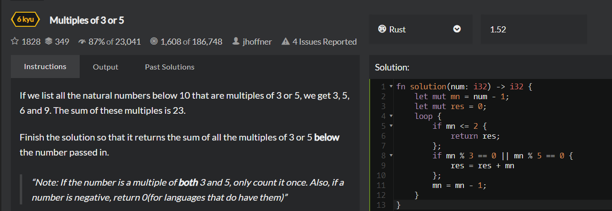
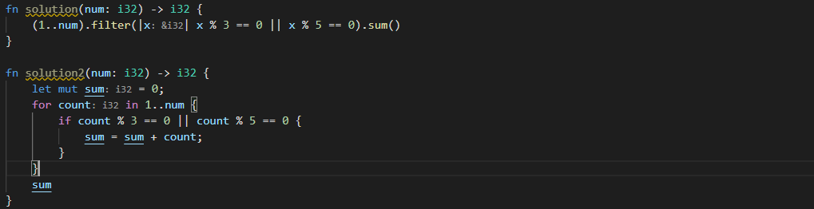
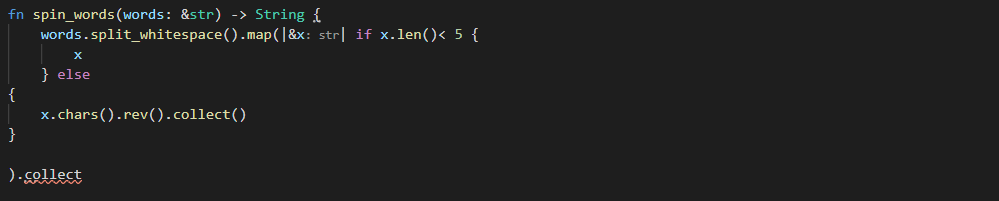
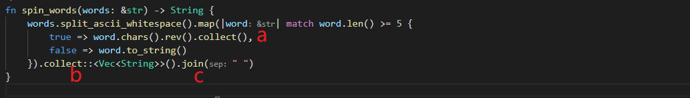

### 按popularity排序
1 wwww Multiples of 3 or 5 计算给定数字以下的3或5的整数倍的所有数字之和

用loop的方法能做出来，但是不太简洁。用下面的方法。

(1..num)的形式然后迭代或者循环，它是一个名为range的特殊数据类型（但也是一个结构体）。 zzzz
***
2 cccc Sum of Digits / Digital Root 看不懂答案
***
3 wwww Stop gninnipS My sdroW!  反转超过5个字母的单词

写到这里就不知道怎么写了，看官方答案。

a，这里collect后不标注类型应该是因为它能根据上下文自动推断类型。  
b，注意这里collect指定类型的格式。  
c，不加join的话结果就是个String组成的vector。加了它让其变为一个String。join的作用大概是把vector这样的复合值变为单值。
***
4 cccc Counting Duplicates 
***
5 cccc Persistent Bugger.

***
以newest排序，但只做500以上收藏的题目
***
1. Create Phone Number
