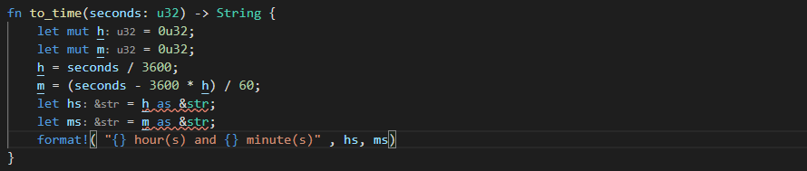

1 Moves in squared strings (I)
太难，cccc
***
2 Leap Years

match 这样用是错的，用最佳答案的方式。

***
3 Over The Road
没看懂题目
***
4 Highest and Lowest

  
<mark>code</mark>

  <pre><code>  
fn high_and_low(numbers: &str) -> String {
    let v: Vec<&str> = numbers.split_whitespace().collect();
    let max = v.iter().max().unwrap();
    let min = v.iter().min().unwrap();
    format!("{} {}", max, min)
}
//此答案ramdom_test some_test会报错，其它test不会。
//zzzz cccc
  </code></pre>

***
5 Powers of i   
看不懂题目  
***
6 String ends with?
  

ends_with看后缀是否满足要求。
***
7 Odd or Even?

.

似乎不用考虑vec为空的情况？qqqq。  
注意第二种方式可以用一行代码就做完。
***
8 Floating-point Approximation (III)  
太长 llll
***
9 Robinson Crusoe
llll
***
10 How Green Is My Valley?

***
11 Growth of a Population

***
12 Build a square

repeat重复元素  
join，在元素间添加其它元素  
zzzz
***
13 Printer Errors
llll
***
14 Looking for a benefactor
llll
***
15 Alphabet symmetry

zzzz
***
16 Valid Spacing

char怎么转换为&str？ qqqq   

starts_with  ends_with  contains
***
17 wwww Vowel Count // 找到元音 a e i o u 的个数 

这样是错的。chars似乎不能使用match。 cccc

1 cccc  
2 filter 用一个闭包决定一个元素是否该产生。    
contains返回true如果一个字符串里包含某个子字符串  
count 消耗迭代器，并返回迭代次数。
***
18 iiii Disemvowel Trolls //清除字符串里的元音字母并返回
  
刚好与上一题的方法类似。
***
19 wwww Sort Number 把可变数组的元素按数字大小排列

clone和to_owned效果应该类似，注意即使是引用使用了clone，它的返回值也不再是引用了。  
sort用于从小到大排序，注意v.sort()不是返回值，而是直接改变v。类似push。
***
20 wwww All Star Code Challenge #22 把秒数换成小时和分钟数，剩余的秒数省略。
  
错误，数字不能用as转换为字符串。要用to_string转换。  
  
format中直接使用，反而会自动将类型视为&str   
***
21 wwww Numbers to Letters
   
这是题目

1 map用闭包将一个迭代器映射为另一个迭代器。  
parse::<u8>()将对应数据转换为u8  
注意97 as char 是 a，而不是1 as char 是 a。因为ascii中，a对应97。  
2 b"abc" 的形式是数组而不是字符串。
***
22 jjjj Count the Digit
***
23 jjjj Rotate for a Max
***
24 wwww Substituting Variables Into Strings: Padded Numbers   

自己的方法太死板，所以还是标记wwww。

需要一些print相关知识点
***
25 jjjj Suitcase packing
***
26 jjjj Speed Control
***
27 cccc Billiards triangle 台球三角形级数
***
28 wwww Easy wallpaper

这做法是错的，因为最终解决虽然是string，但仍是数字表示，没转换为英文单词。另外这个算了天花板，但实际不需要计算天花板。

ceil方法向上取整，floor方法向下取整。
***

