1 Reversed sequence

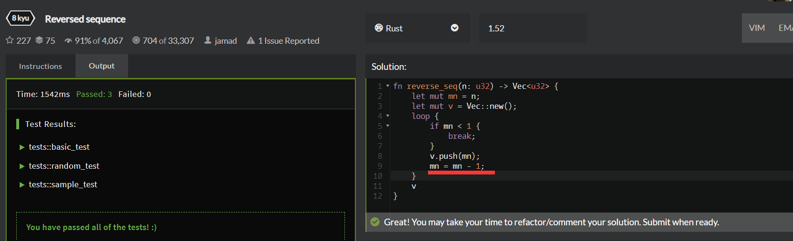
rust似乎不接受 n-- 这种写法。
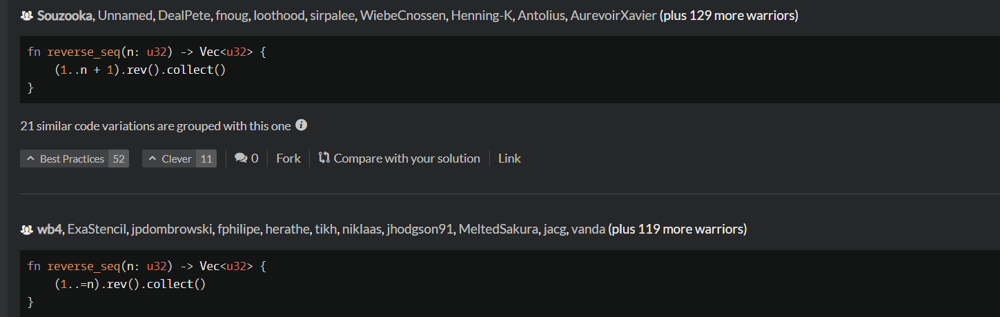
官方使用了rev方法，应该是倒转顺序的方法。
***
2 Find the smallest integer in the array
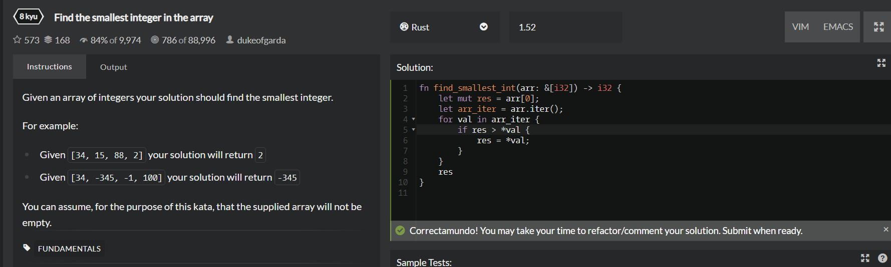
这是迭代器的用法。
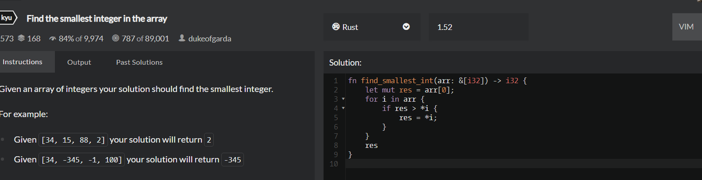
这是for循环用法。
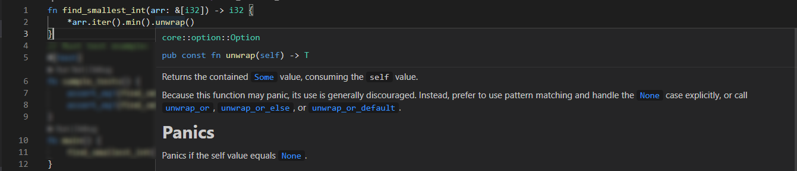
最佳答案，min获得最小值。unwrap大意是返回some包含的值。
***
3 You Can't Code Under Pressure #1
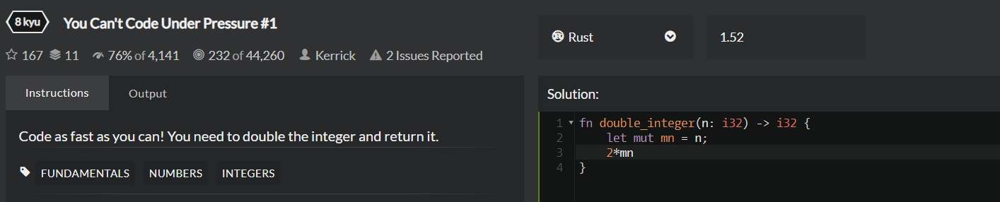
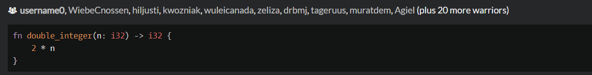
***
4 Sort and Star
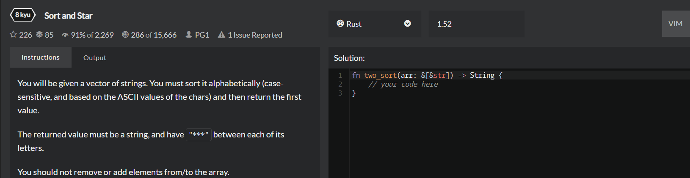
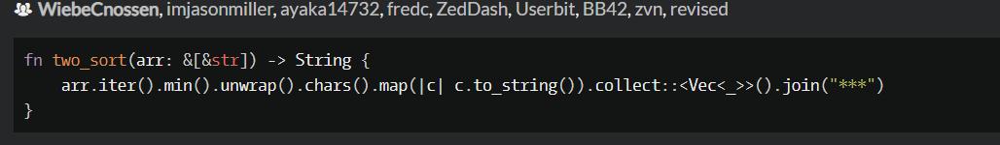
这踢较难，以后再做。cccc
***
5 Get Nth Even Number
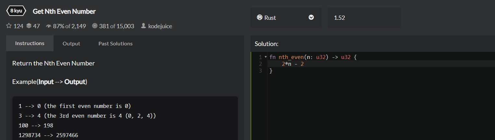
***
6 DNA to RNA Conversion
题目不容易看懂，略
***
7 Invert values
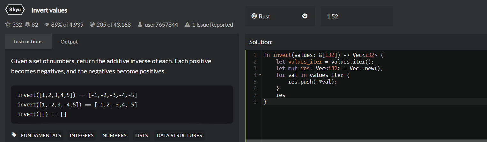
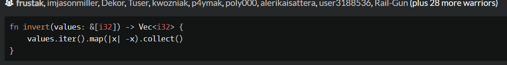
zzzz 需要复习下最佳答案。
***
8 Can we divide it?
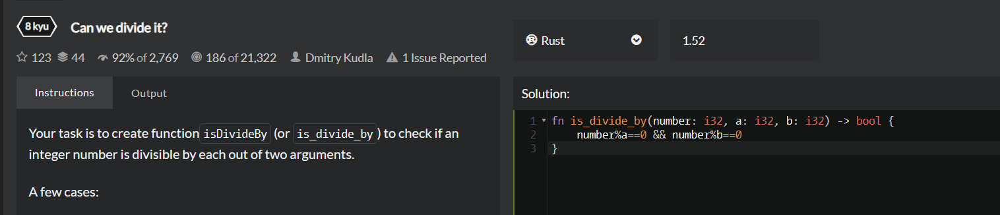
注意中间是两个&&
***
9 Count of positives / sum of negatives 
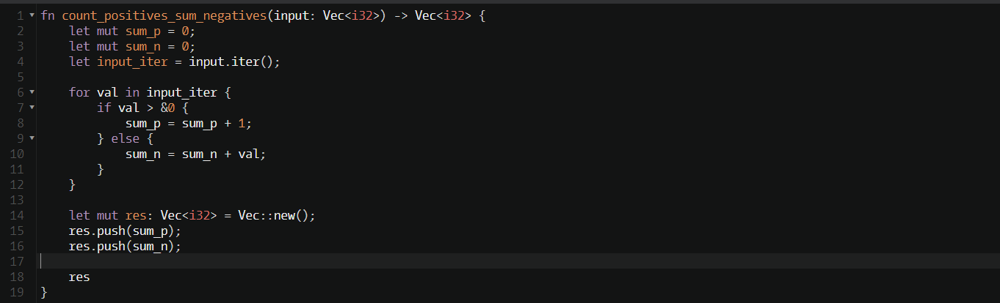
这段代码是错的，没考虑input是空的情况。
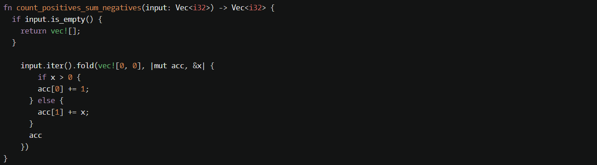
最佳答案。fold方法介绍：https://doc.rust-lang.org/std/iter/trait.Iterator.html#method.fold
***
10 Remove String Spaces
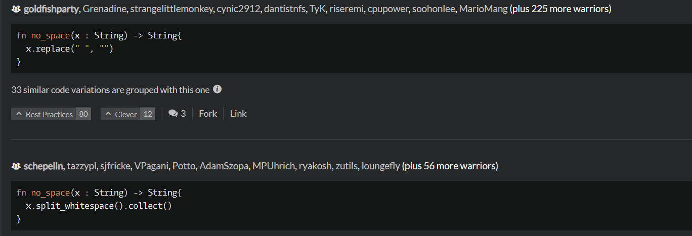
replace用去替换字符串的内容。  
split_whitespace()用于以空格为界限分割字符串。
***
11 Difference of Volumes of Cuboids
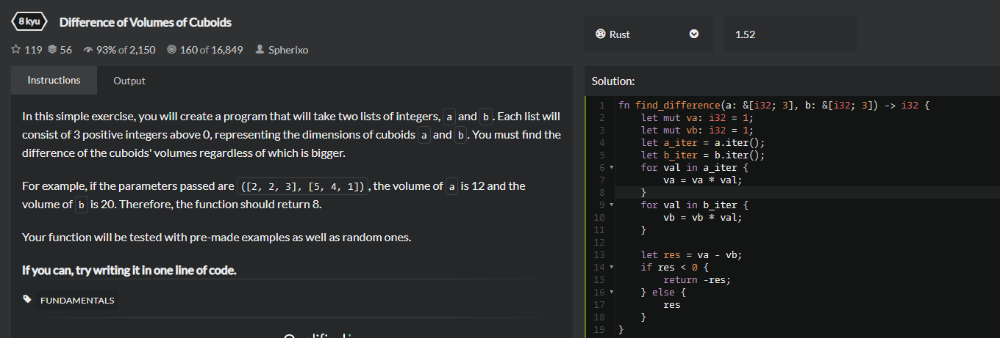
***
12 Difference of Volumes of Cuboids
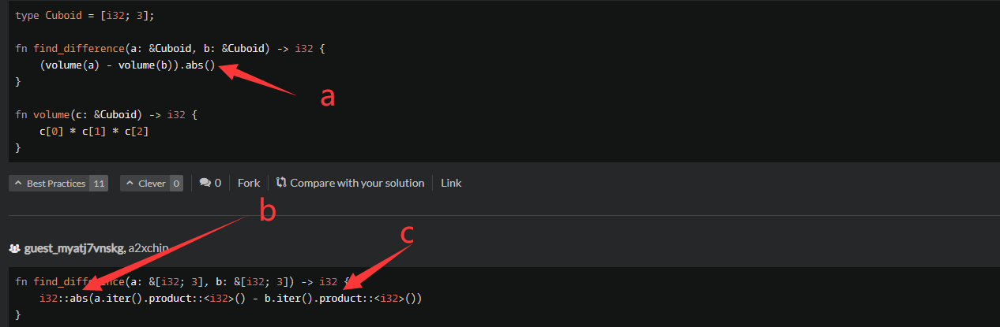  
a,b abs计算绝对值  
c，product计算乘积。
***
13 A wolf in sheep's clothing
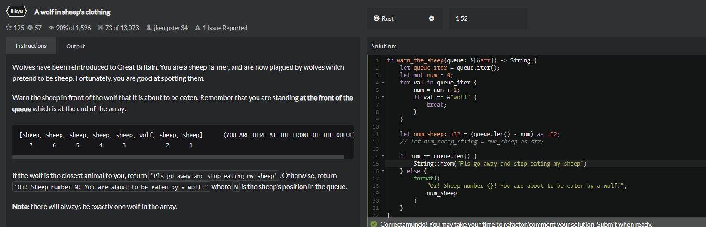
zzzz string::from 里面不能加变量，format! 可以。
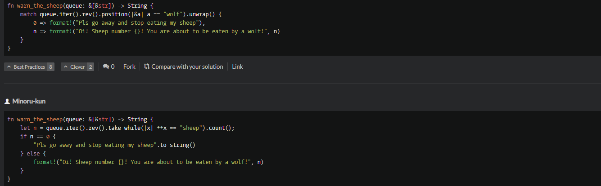
rev让迭代器的序列颠倒。position获得元素在序列中的值，由some index,或none保存。unwrap获取some里的值。
***
14 Convert a Boolean to a String
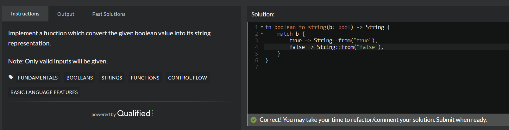
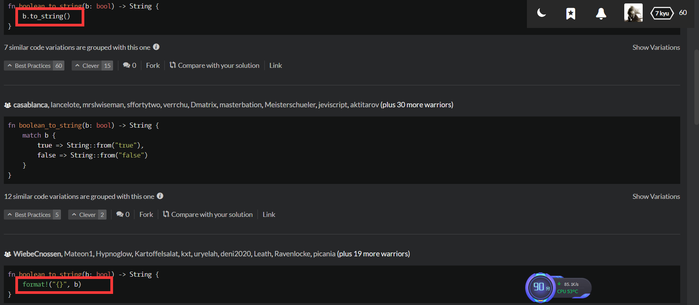
***
15 The Feast of Many Beasts
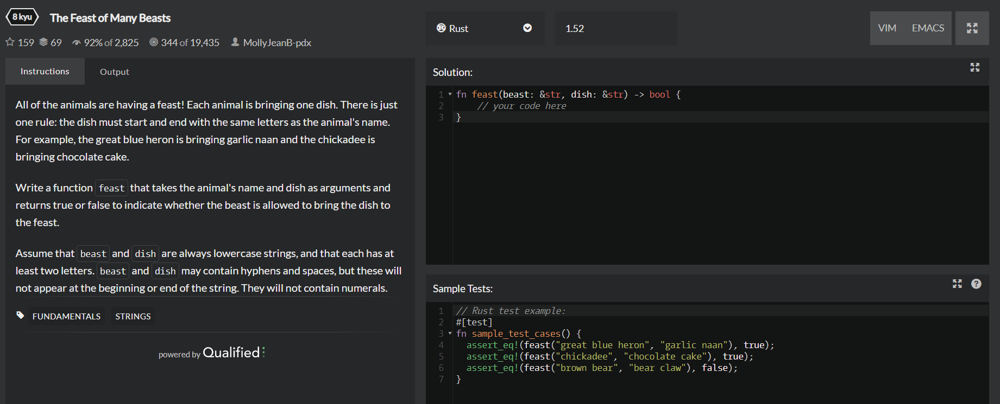
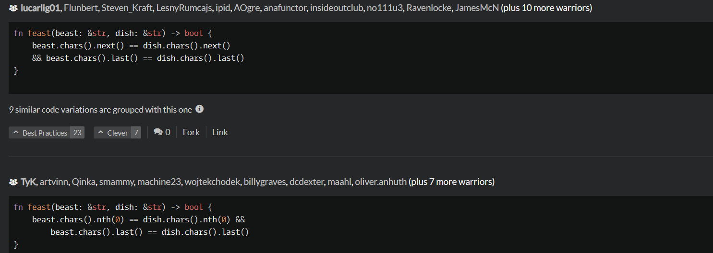
chars() Returns an iterator over the chars of a string slice.  迭代字符。  
last() 返回迭代的最后一个元素。  
nth(n) 返回迭代的第n个元素。
***
16 Convert a Number to a String!
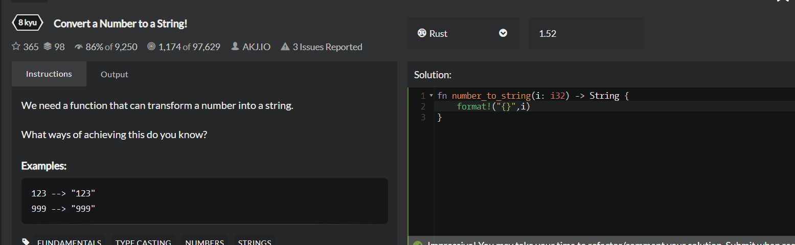
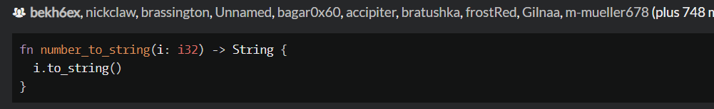
***
17 Grasshopper - Terminal game move function
没看懂题目。llll
***
18 Reversed Strings
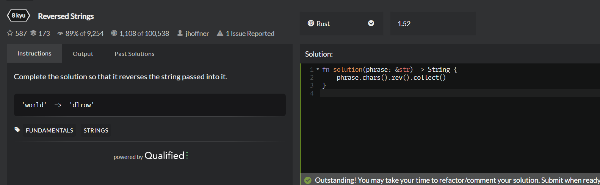
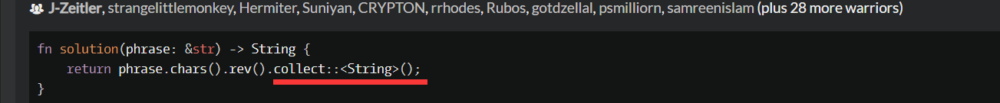
可以像最佳答案这样用collect::<String>()手动指定类型。
***
19 Is he gonna survive?
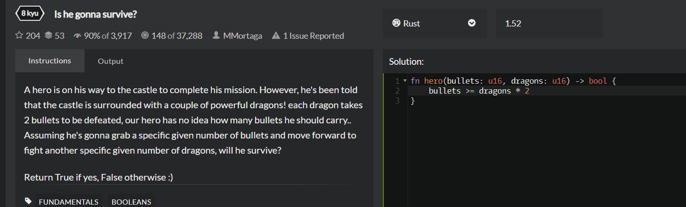
可能导致乘法溢出，但暂时不考虑。
***
20 Grasshopper - Summation
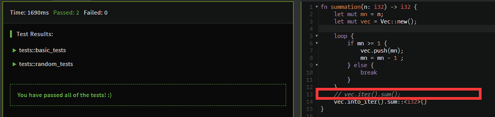
zzzz 目前理解是用vec.iter().sum()，因为iter只能获得引用，但加起来不能输出为引用的结果（因为没有值给它引用），所以会报错。而用vec.into_iter().sum()因为获得了所有权，所以没问题，不用显式指定类型。而用vec.iter().sum::<i32>()，因为指定了输出为i32类型，所以虽然接收的是&i32，但仍然正常输出
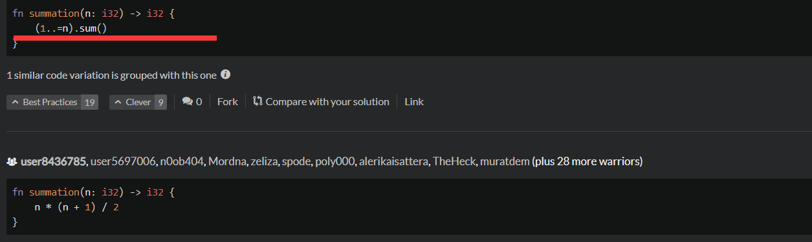
