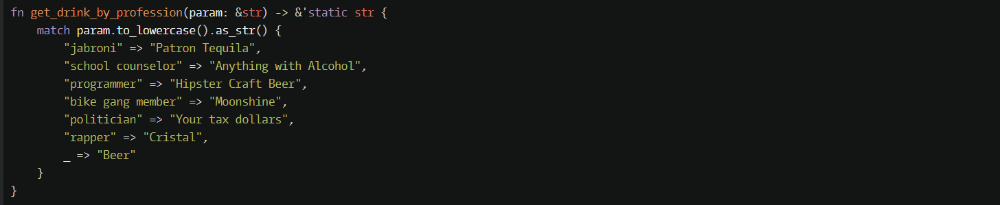

1 Sum of positive

is_positive()方法判断是否为正。
***
2 Function 1 - hello world

需要返回值而不是打印值。
***
3 Beginner - Reduce but Grow

***
4 Beginner - Lost Without a Map

***
5 Century From Year

***
6 Do I get a bonus?

***
7 get character from ASCII Value

***
8 L1: Bartender, drinks!

match 不能写.to_string()或者类似的函数调用

也可以这样，不过暂时不懂为什么要用&*而不是&。
***
9 Smallest unused ID

这样写能通过测试，但不能通过提交。

**skip_while:** Creates an iterator that skips elements based on a predicate. skip_while() takes a closure as an argument. It will call this closure on each element of the iterator, and ignore elements until it returns false After false is returned, skip_while()'s job is over, and the rest of the elements are yielded.    
大意是当闭包返回false时停止遍历，还没遍历的元素会保留。  
zzzz
***
10 Parse nice int from char problem  
 
这样结果是错误的，不能用as。
  
a,&str可以用[..1]获得第一个字符。  
b,parse()方法可以转换很多种类型。这里应该是通过函数签名自动推断为u32类型。  
c,to_digit(10)方法把字符转换成10进制数字。
***
11 N-th Power 

get方法，pow power n次方方法。
***
12 Filling an array (part 1)

活用(0 .. n)这种方式。
***
13 Function 2 - squaring an argument 

***
13 Dollars and Cents

{:02}固定写法，round取与其最接近的整数。
***
14 Beginner Series #2 Clock

***
15 Holiday VI - Shark Pontoon
太长不看
***
16 Multiply

***
17 Check the exam

zzzz  
test能通过，但random不能，不知啥原因。  

zip，链接两个迭代器。fold把元素弄进计算器、叠加器。max(n)取值和n中的最大值。
***
18 Switch it Up!

这个方法不错。
***
19 L1: Set Alarm

!表示取反

这个不懂 qqqq
***
20 Are You Playing Banjo?

这是错误的，因为得到的是option，而不是char。需要使用unwrap或后面介绍的unwrap_or。

a, &name[0..1]就能取第一个字符。  
b, starts_with返回布尔值  
c, unwrap_or 用法，似乎必须接单引号。   qqqq