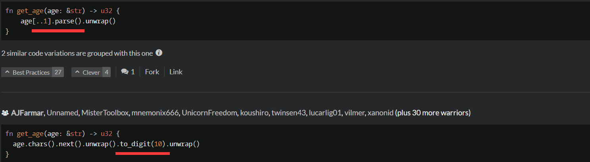

1 Sum of positive

is_positive()方法判断是否为正。
***
2 Function 1 - hello world

需要返回值而不是打印值。
***
3 Beginner - Reduce but Grow

***
4 Beginner - Lost Without a Map

***
5 Century From Year

***
6 Do I get a bonus?

***
7 get character from ASCII Value

***
8 L1: Bartender, drinks!

match 不能写.to_string()或者类似的函数调用

也可以这样，不过暂时不懂为什么要用&*而不是&。
***
9 Smallest unused ID

这样写能通过测试，但不能通过提交。

**skip_while:** Creates an iterator that skips elements based on a predicate. skip_while() takes a closure as an argument. It will call this closure on each element of the iterator, and ignore elements until it returns false After false is returned, skip_while()'s job is over, and the rest of the elements are yielded.    
大意是当闭包返回false时停止遍历，还没遍历的元素会保留。  
zzzz
***
10 Parse nice int from char problem  
 
这样结果是错误的，不能用as。
  
a,&str可以用[..1]获得第一个字符。  
b,parse()方法可以转换很多种类型。这里应该是通过函数签名自动推断为u32类型。  
c,to_digit(10)方法把字符转换成10进制数字。
***
