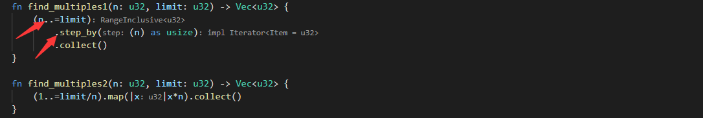
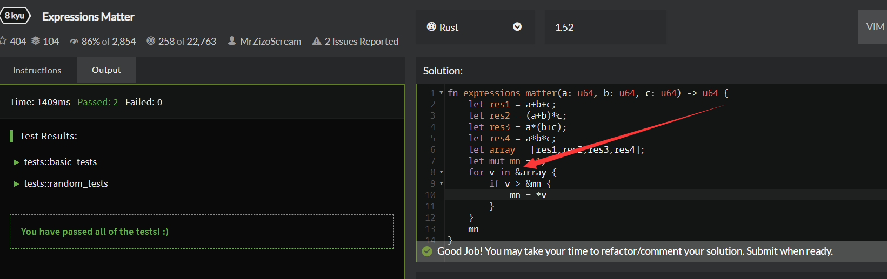
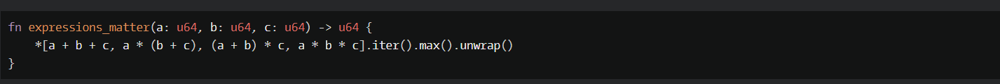

1 Hello, Name or World!

a, is_empty 如是空值返回true。  
b，思路，将一个词拆为两个部分处理。[..1]代表首字符[1..]表示余下的。
***
2 Messi's Goal Total

题目和答案都很特殊
***
3 Coefficients of the Quadratic Equation
llll
***
4 Is n divisible by x and y?

***
5 Find Multiples of a Number

a, 注意这种写法
b， step by，一次迭代增加多少个。
***
6 Welcome!
llll
***
7 Get Planet Name By ID

方法值得学习，不用在每个分支后加tostring，直接在最后加就行。
***
8 Subtract the Sum
较难 cccc
***
9 Expressions Matter

for 数组循环里，数组前需要加&。

max()方法找最大值
***
10 altERnaTIng cAsE <=> ALTerNAtiNG cAsE

qqqq 不知道为什么报错

zzzz  
String::with_capacity 创建具有特定长度的String。  
chars对str生成迭代器。  
is_uppercase()如是大写返回true。  
extend 延伸string。在最后增加元素。
***
11 Thinkful - Number Drills: Blue and red marbles
太长llll
***
12 Opposite number
太简单llll
***
13 Grasshopper - Check for factor
太简单 llll
***
14 Count the Monkeys!

获得递增vector的方法 (1..n + 1).collect()
***
15 The 'if' function

看不太懂函数签名  qqqq。
***
16 8kyu interpreters: HQ9+
cccc 很奇葩。
***
17 Third Angle of a Triangle
太简单llll
***
18 Convert a String to a Number!

parse后记得加unwrap才行。
***
19 Even or Odd
太简单 llll
***
20 Grasshopper - Terminal game combat function
太简单 llll

.max方法，取最大值。