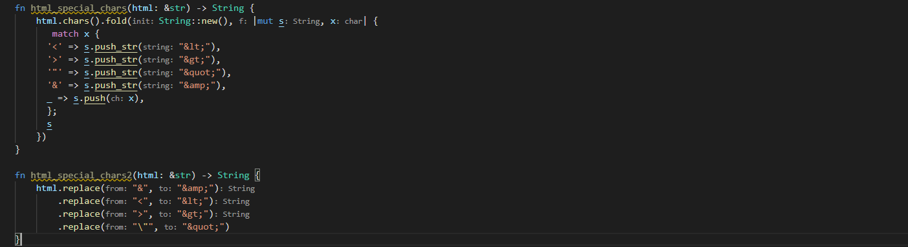

1 Bin to Decimal

这样是错的。  
  
a, from_str_radix，将字符串里是数字的转化为数字类型  
b，fold 叠加器。
c，qqqq。
***
2 If you can't sleep, just count sheep!!

collect能自动将元素收集为想要的形式。

多次出现了，记住1到n的形式用这个方式。
***
3 What's up next?

a，skip_while，当返回为true时，跳过元素，直到返回为false。 nth(1),当前元素起的第2个元素。 cloned：Maps an Option<&T> to an Option<T> by cloning the contents of the option.
b，qqqq
***
4 Thinkful - Number Drills: Pixelart planning
太长llll。
***
5 Jenny's secret message
太简单llll
***
6 Safen User Input Part I - htmlspecialchars

a,zzzz
b,replace方法。替换指定的部分，其余部分不变。
***
