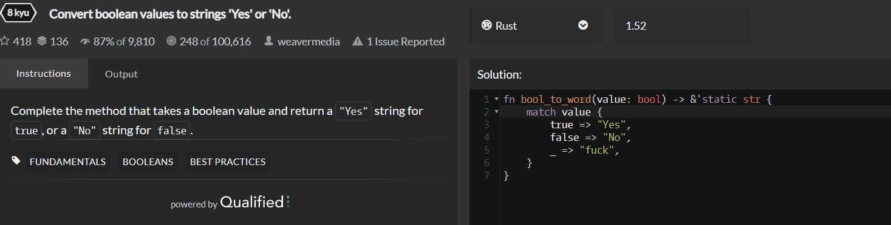
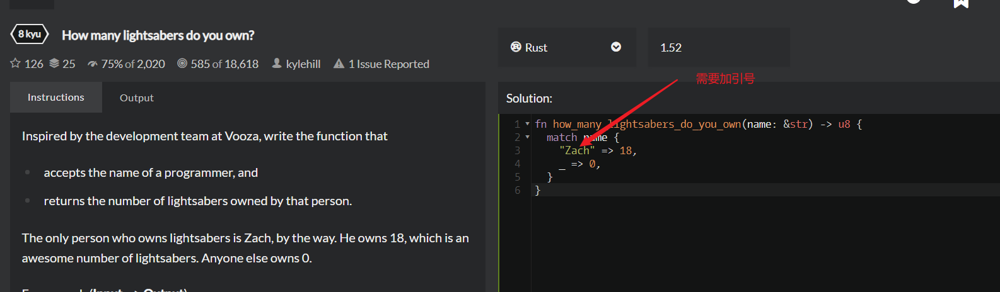
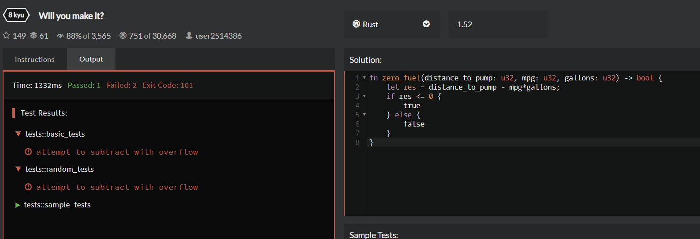
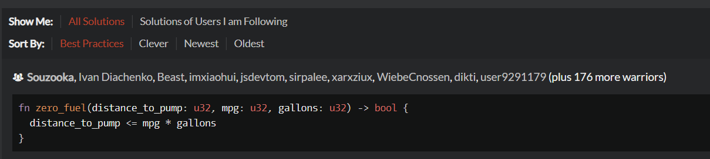
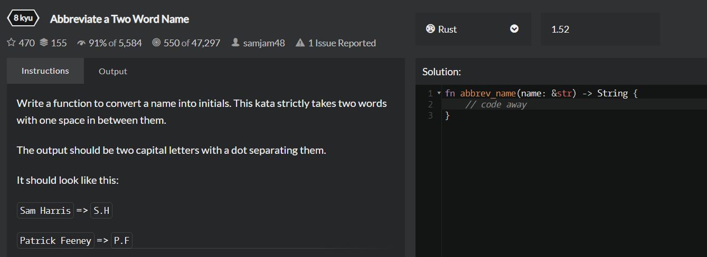
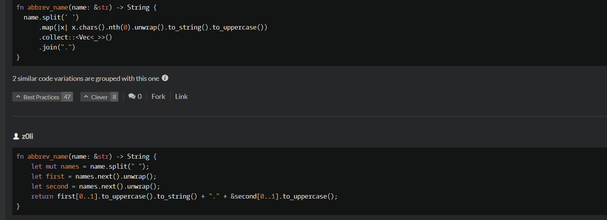
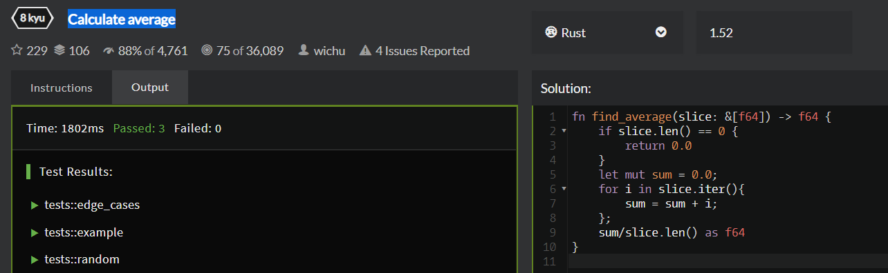
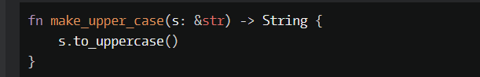
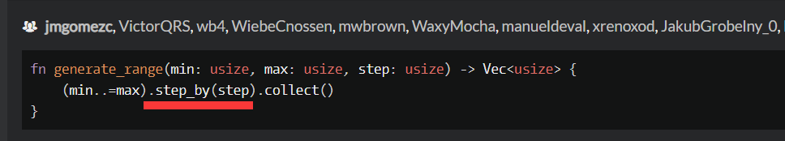

Get the mean of an array
```
fn get_average(marks: &[f32]) -> f32 {
    let mut sum:f32 = 0.;
    for ele in marks.iter(){
        sum = sum + ele;
    }
    let mut ave = (sum/marks.len() as f32).floor();
    ave
}
//floor() 方法执行的是向下取整计算,它返回的是小于或等于函数参数,并且与之最接近的整数。
//as f32 转换类型
//f32 类型需加小数点
```

Quarter of the year
```
fn quarter_of(month: u8) -> u8 {
    match month {
        1..=3 => 1,
        4..=6 => 2,
        7..=9 => 3,
        10..=12 => 4,
        _ => unreachable!(),
    }
}
//1，2，3这样是错的
//_匹配其余所有值
```

Reversed Words
```
太难，先不处理
```

Gravity Flip
```
太难，先不处理
```

Returning Strings
```
1,
fn greet(name: &str) -> String {
    format!("Hello, {} how are you doing today?", name)
}
2,
fn greet(name: &str) -> String {
    let mut hello = String::from("Hello, ");
        hello.push_str(name) ;
        hello.push_str(" how are you doing today?") ;
    return hello;  
}
//format!可以返回一个字符串
```

Thinkful - Logic Drills: Traffic light
```
fn update_light(current: &str) -> String {
    match current {
        "green" => "yellow".to_string(),
        "yellow" => "red".to_string(),
        "red" => "green".to_string(),
        _ => "wrong".to_string(),
    }
}
//rust中是to_string而不是toString
//也可以不用每句都to_string，而是最终返回一个to_string。
```

Remove First and Last Character
```
//目前太难，先不掌握，答案：https://www.codewars.com/kata/56bc28ad5bdaeb48760009b0/solutions
```

String repeat
```
fn repeat_str(src: &str, count: usize) -> String {
  src.repeat(count)
}
// repeat是str的方法
// The str type, also called a ‘string slice’, is the most primitive string type. It is usually seen in its borrowed form, &str. It is also the type of string literals, &'static str.
```
Calculate BMI

注意这两种方式来match

Find the first non-consecutive number  
太难，以后再掌握 mark

Multiplication table for number
太难，以后再掌握 mark

Keep Hydrated!

***

//match bool似乎不需要用_ 
***

***


***
Abbreviate a Two Word Name  
重点，mark

.

***
Calculate average

***
MakeUpperCase  

换成大写，直接使用to_uppercase()就行。
***
Will there be enough space?   
题目太复杂，略过
***
Holiday VIII - Duty Free
题目太复杂，略过
***
Generate range of integers

step_by大概是按设置的参数作为间隔挑选集合中的值
